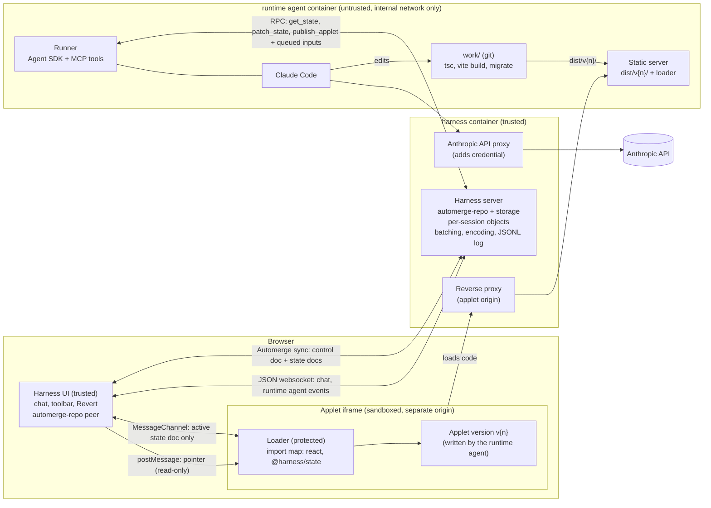
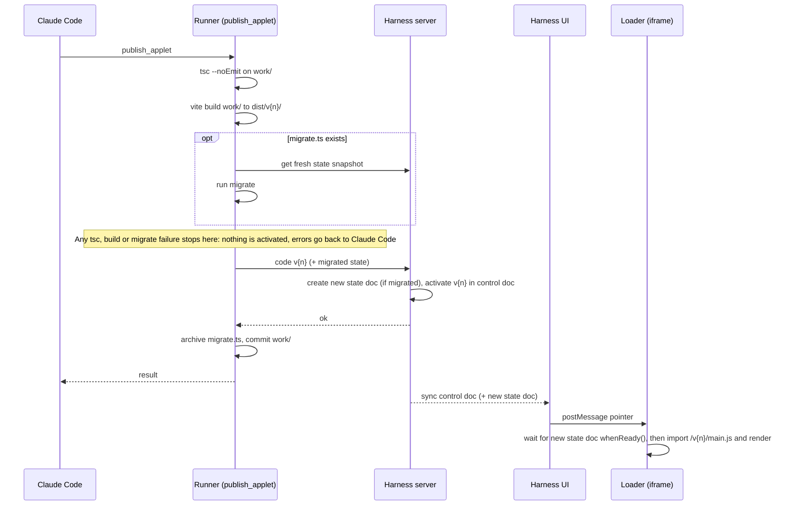

# Familiar — High-level design

Relevant decision records:
- [000-initial-design.md](../decision-records/000-initial-design.md)

## Vision

Malleable apps aren't fixed artifacts someone makes for you and your activities. They're **experiences you co-create with an AI to suit you and your activities**. The runtime agent is present throughout, both reshaping the applet and supplying intelligence *inside* it. Examples:

- "Let's make a shopping list. Can you please add ingredients for 6 hamburgers with toppings, with allergens noted?"
- Interactive fiction, with non-player dialog and action written by the runtime agent.
- Playing chess against the runtime agent.
- Asking questions about a slideshow on how to play Go.
- Automatic translation as you type.

**The app is the agent.** The runtime agent role-plays as the app. This barely changes its behavior, but it simplifies the user's mental model: you aren't using an app *with* an agent, you're using an app that can act and change.

## Terminology

- **App:** the whole experience the user uses: the harness UI plus the applet.
- **Applet:** the part of the app the runtime agent writes, rendered in a sandboxed iframe.
- **Harness:** the trusted part of Familiar: the harness server plus the harness UI.
- **User data:** state in Automerge. React state (focus, scroll, text being typed) is not user data; losing it is an interruption, not data loss.
- **Runtime** scopes the parts of Familiar that serve the running app:
  - **runtime agent:** the Claude Code agent inside Familiar, which rewrites the applet and acts inside it. Plain "agent" means a coding agent working on this repository.
  - **runtime agent container:** the container the runtime agent runs in. It also builds and serves the applet. (The harness runs in a container too, so "runtime container" would be ambiguous.)
  - **runtime tools:** the tools the runtime agent calls (`get_state`, `patch_state`, `publish_applet`).
  - **runtime instructions:** the runtime agent's CLAUDE.md and system-prompt text. Not to be confused with this repository's `AGENTS.md` files.
- **Version:** an immutable pair of a built code version (`v{n}`) and the state doc it uses. Versions form a history; none are deleted.
- **Publish:** turn the runtime agent's edits in `work/` into a new version and activate it. The runtime agent publishes by calling the `publish_applet` runtime tool. Publishing is **all or nothing**: it validates and builds the code, migrates state if the schema changed, and ends by activating the new version; if any step fails, nothing is activated and the runtime agent gets the errors. The exact steps may change; they're in [code versions](code-versions.md#publish-pipeline).
- **Activate:** make a version the **active version**, the one that runs. Activation is a single control-doc write, followed by the loader switching over once the version's state doc is ready. Publishing ends by activating the new version; rollback (Revert) activates an earlier one.

## Goals

Goals settle recurring questions by default; a specific decision can override one with a stated reason.

**Product**

- **G1. Avoid interrupting the user during applet changes.** Rewrites happen while the user keeps working. When an interruption is unavoidable (e.g. locking and graying out the applet during activation), keep it visible and brief, and prefer designs that avoid it. Losing React state (a half-typed input, scroll position, focus) counts as an interruption.
- **G2. Never lose user data during applet changes and actions.** *User data* is state in Automerge. **Not met in the MVP.** Known gaps:
  - Edits made to the old state doc after a migration's snapshot are lost (see [state](state.md#schema-changes)).
  - If the rejected version changed the schema, Revert goes back to the older state doc, so changes made in the newer one no longer show (see [code versions](code-versions.md#rollback)). The newer doc itself is kept (G10). Versions without a schema change share a state doc, so reverting them loses nothing.
- **G3. No initial domain knowledge.** The applet starts out knowing nothing about spreadsheets, chess or anything else; the runtime agent supplies it. Hence no domain libraries (see [code versions](code-versions.md#applet-code-conventions)).
- **G4. The runtime agent is a participant, not only a builder.** It acts inside the applet (a chess move, a translation) as well as rewriting it. This holds independently of the runtime agent role-playing as the app.
- **G5. Sandbox the runtime agent, and guardrail the applet.** The rule that achieves most of this, that the harness never runs runtime-agent-written code, is in [security](security.md#trust-boundaries).
- **G6. Build on current coding models and their harness** (Claude Code via the Agent SDK) instead of a custom agent loop.

**Engineering**

- **G7. Recover without the runtime agent's help.** The runtime agent, its container, or the code it wrote may be what's broken, so the harness can always roll back or restart on its own.
- **G8. Free or cheap change attribution.** Prefer designs where the harness *knows* who made a change because of how it arrived, over designs that infer it afterwards (e.g. from actor IDs). Telling the user's changes from the runtime agent's keeps it from reacting to its own output, and enables "undo what the runtime agent did" later. Inferred attribution was a rabbit hole in the original project.
- **G9. No decision prevents scaling out.** There is no plan to scale out, but designing for a second deployment context exposes bad assumptions (see [roadmap](roadmap.md#deployment-contexts)).
- **G10. Keep history easy to access.** Versions, state docs and their Automerge history are kept, not garbage-collected.
- **G11. Keep multi-tab possible** (weak). One user may have Familiar open in several tabs; untested.

## Non-goals

- **N1. Multi-user.** Collaboration needs a radically different design: conflict management when users want mutually exclusive things, and reconciling data with room for contradiction and confidentiality. None of that arises in a single-user design. (Cloud multi-tenancy, i.e. many isolated single-user sessions, is fine; see G9.)
- **N2. The applet working without the runtime agent.** The runtime agent's presence is the product.
- **N3. Productization.** No plan to ship; G9 only keeps the door open.
- **N4. Performance beyond toy applets.**
- **N5. Real-time responsiveness.** A runtime agent turn takes seconds; that's accepted.
- **N6. Locking down code in the same JS realm** (e.g. Hardened JS). Enforcement happens at channels instead (see [state](state.md#documents)).
- **N7. Standalone or exportable apps.** An applet is part of an ongoing, co-created experience, not an artifact to hand off. (Using Familiar as a vibe-coding tool with an ultra-tight dev loop would make sense, but isn't pursued.)

## Design docs

| Doc | Covers |
|---|---|
| [state.md](state.md) | Automerge documents and the pointer, schema changes and migration, the in-applet `store` API, what goes in Automerge vs. React state, applying the runtime agent's patches |
| [code-versions.md](code-versions.md) | Immutable built versions, the publish pipeline and validation gate, the loader, rollback, conventions for applet code |
| [runtime-agent.md](runtime-agent.md) | The runner, tools, what the runtime agent sees (deltas, batching, encoding), concurrency, response options, model, runtime instructions |
| [security.md](security.md) | Trust boundaries, container hardening, the credential, the applet iframe sandbox, egress, prompt injection |
| [ux.md](ux.md) | Layout, activity feedback, consent for rewrites, undo, sessions, where chat lives |
| [engineering.md](engineering.md) | Repo layout, tooling, the event log and observability, cost controls |
| [roadmap.md](roadmap.md) | Milestones (Spike 0, PoC 1, PoC 2, MVP), scope, deferred work, deployment contexts |

## Architecture overview

MVP shape. In the PoCs the harness runs on the host, the runtime agent container has a normal network with the subscription OAuth token in its env, and the browser loads the applet straight from the container (see [roadmap](roadmap.md)).

**Data:** the **control doc** (harness-only) holds the **active version** pointer `active: { code: "v{n}", stateDoc: "<id>" }`. Each schema version has its own **state doc**, whose root is `State`. The iframe can reach only the active state doc (see [state](state.md#documents)).

**Publish and activate** (see [code versions](code-versions.md#publish-pipeline) and [state](state.md#schema-changes)):

## Open questions

None yet.
